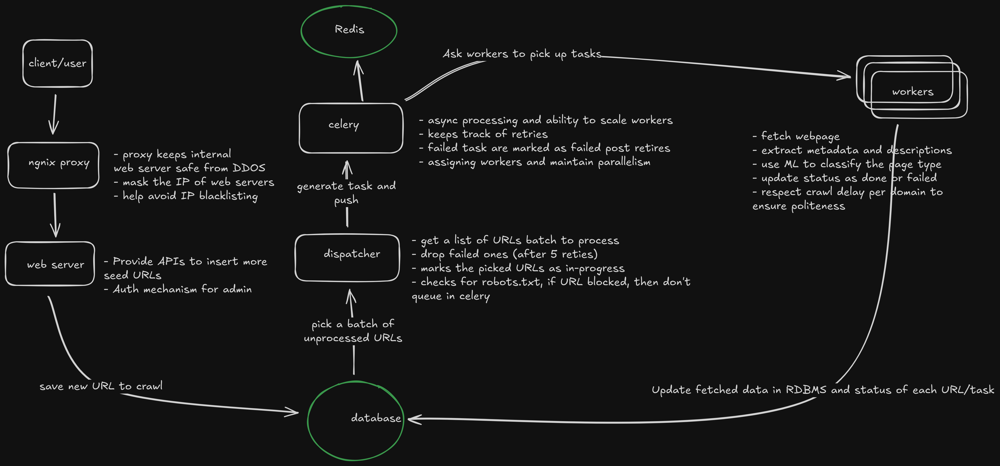
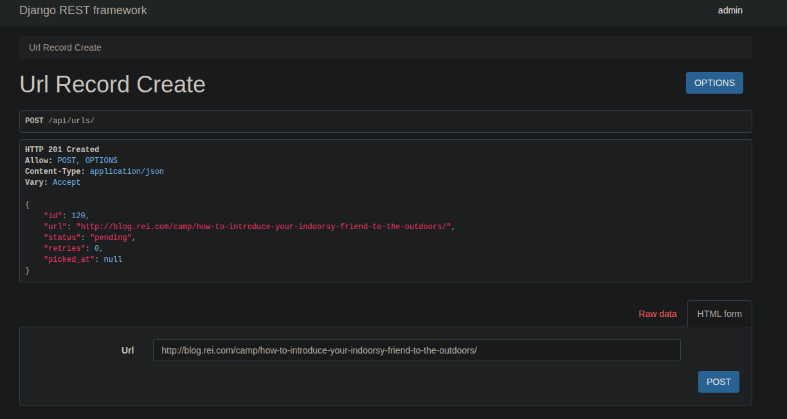
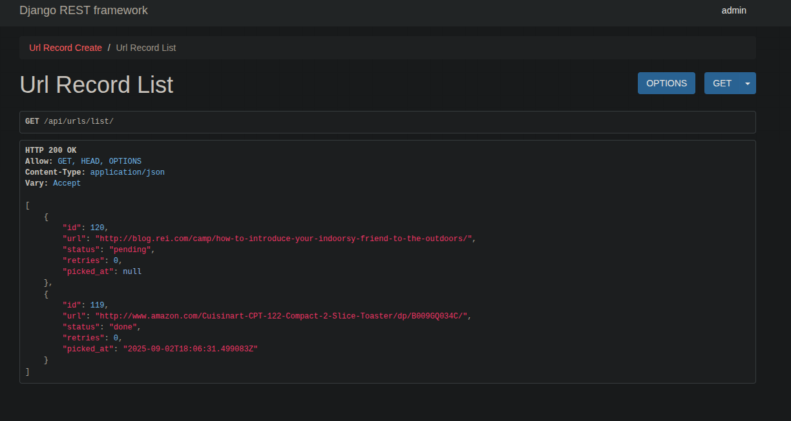
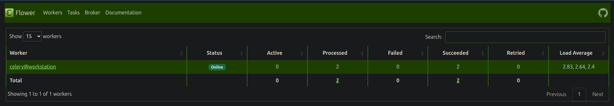
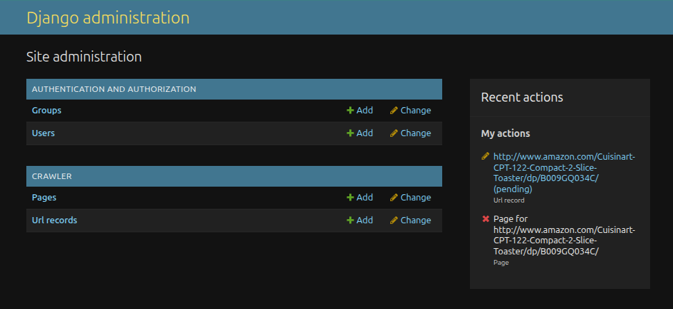
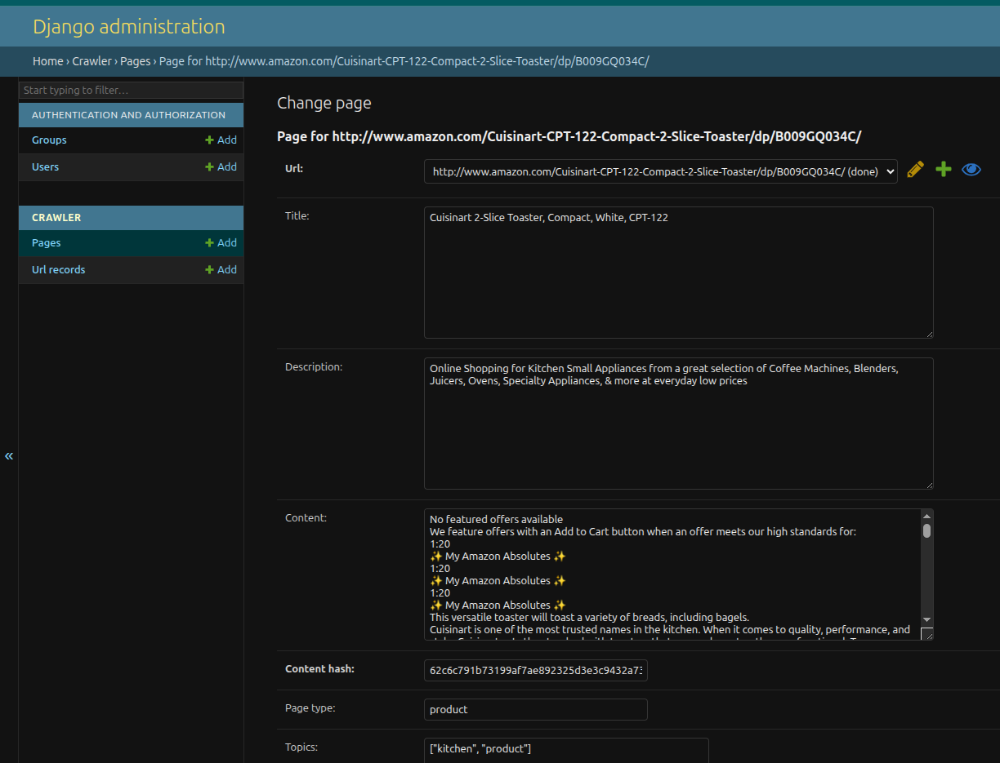
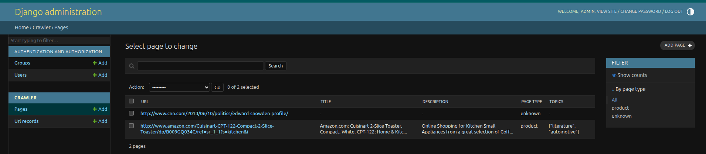
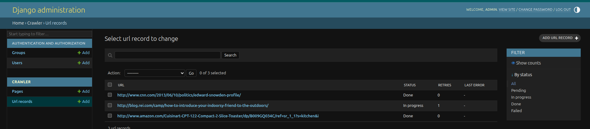

# web crawler
This project is a Django-based web crawler service with REST API endpoints, asynchronous task processing (Celery), and PostgreSQL for persistent storage. It supports distributed crawling, URL queueing, and metadata extraction.

# Architecture Diagram


## How to setup project in local

- clone the repo
- install docker and docker compose
- run project `docker compose up`
- access the dashboards as shown in screenshot below

#### Dashboard
- http://127.0.0.1:80/api/urls/ - post new URL and this will be picked up by dispatcher



- http://127.0.0.1:80/api/urls/list/ - show all URLs along with their status



- http://localhost:5555/ - dashboard for celery task workers



- http://127.0.0.1:80/admin/ - admin dashboard



- http://127.0.0.1:80/admin/crawler/page/5/change/ - admin page to view crawled page



## Steps to use
- insert a URL to crawl in http://127.0.0.1:80/api/urls/. And it will be auto picked up.
- See the admin dashboard for progress http://127.0.0.1:80/admin/ (username: 'admin', password: 'pass')




## For Future Extensibility (design to crawl billions of URLs)

#### Orchestration
- Ingestion service, which read URL lists from CSV/DB and push to Kafka (seed-urls).
- Scheduler / URL frontier consume fro kafka and dedupe, filter for robots.txt and enqueu items in per-host partitions queues.
- Config service, which keep record of robotx.txt, crawl delay per domain, user agents, if permitted then JS rendering allowed. max depth to crawl.
- Check for malicious URL or URL web attacks.
- Orchestrator to auto scale fetch pool workers.

#### Data Fetch
- stateless workers, pull from frontier, fetch, parse, classify and write data.
- JS fetcher / headless browser for domain which have dynamic content.
- Dedup service, reject already saved content based on hash of content.
- Storage - Raw Content in S3, Metadata/indexes in OLTP/psql, OLTP/lake for analytics.

#### Observability
- Prometheus + Grafana for metrics
- Kafka UI
- Flower/Celery Dashboard for task health

#### Cost/Performance
- Workers to fetch data are auto scaled up and down.
- Compess data before storage if we don't need to query it.
- Maintain data in hot and cold tiers.
- Async processing in fetch workers to parallelize load.
- DNS catch.
- URL idempotency, repeated fetch compare hash of content and don't duplicate data.
- Dead Letter topics for poison/malacious URLs.

#### SLA and SLO
- Maintain Crawl completion rate - Like 90% completion rate, out of all the URL loaded in queue.
- Freshness Lag - when was the last time the content for a page was fetched. Like P90 < 24h.
- Availability - metadata in OLTP in < 5 min lag. In S3 withing 15 min lag.
- Monitoring core services - frontier, kafka, fetcher, classifier delay.

# For Author
These are just notes for author himself. and for more advanced users.

## Manually run workers to queue URLs or clean dead/stuck URLs

```bash
# pick urls in 'queued' or 'failed' with <5 reties and push them to queue
$ python manage.py dispatch_urls --batch 5
Pushed 1 urls to queue

# when fetch worker fails - URL remain 'in progress' in DB
# reconcile worker those to 'failed' and increase retry count by 1
$ $ python manage.py reconcile_records
Marked 0 stuck URLs as failed

# celery worker to consume task
celery -A crawler_service worker -l info -Q crawler
# flower - celery UI
celery -A crawler_service flower --port=5555

```
